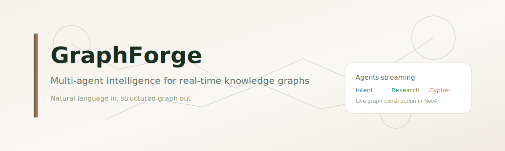
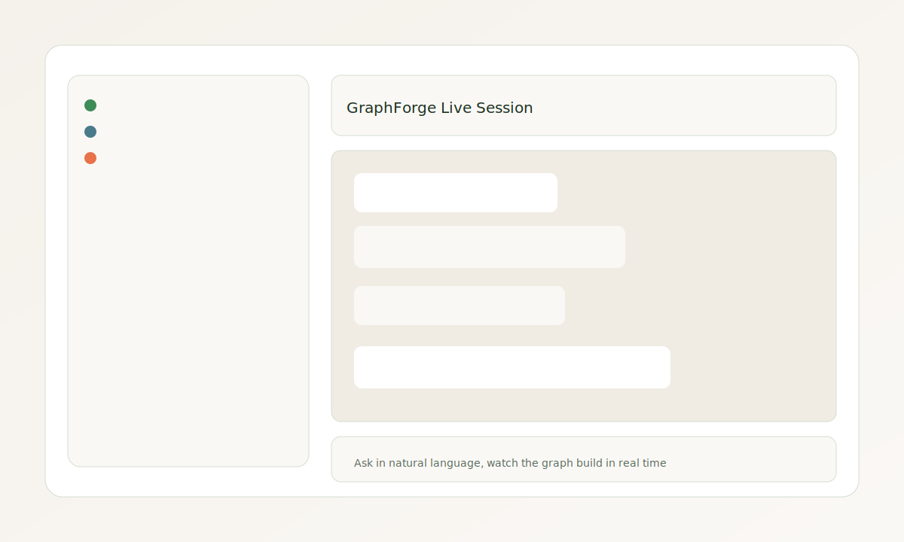
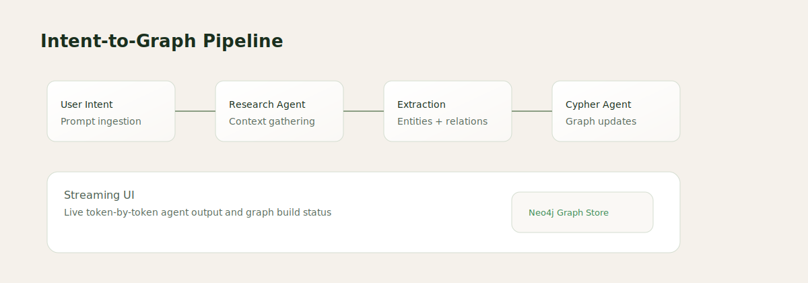
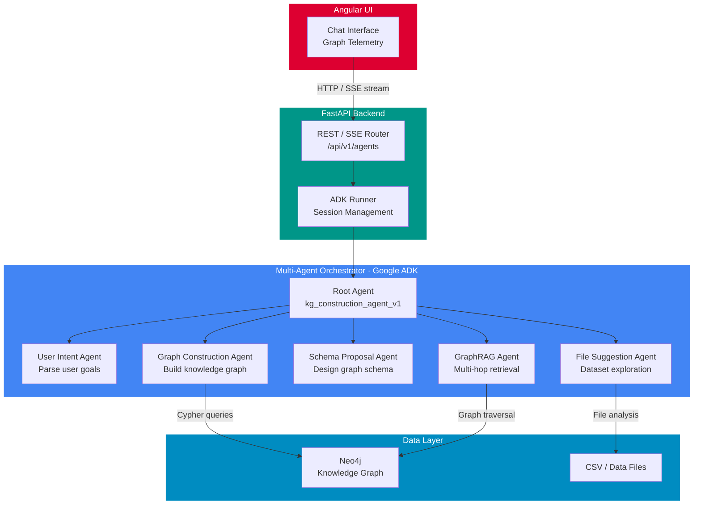
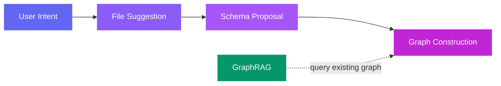

# GraphForge



<p align="center">
  
  
  
  
  
  
</p>

GraphForge is a multi-agent intelligence platform that transforms natural language intent into structured knowledge graphs. It orchestrates specialized AI agents to understand queries, research domains, extract entities, and construct Neo4j-based knowledge graphs in real time.

## Highlights

- Multi-agent orchestration for research, extraction, validation, and construction.
- Natural language to graph with real-time streaming updates.
- FastAPI backend with direct Cypher integration.
- Angular UI for live chat and graph build telemetry.
- Sample data for a furniture product knowledge graph.

## Product Preview



## Intent-to-Graph Pipeline



## Tech Stack

<table align="center">
  <tr>
    <th>Layer</th>
    <th>Technologies</th>
  </tr>
  <tr>
    <td><strong>Frontend</strong></td>
    <td>
      
      
      
    </td>
  </tr>
  <tr>
    <td><strong>Backend</strong></td>
    <td>
      
      
      
    </td>
  </tr>
  <tr>
    <td><strong>AI / Agents</strong></td>
    <td>
      
      
    </td>
  </tr>
  <tr>
    <td><strong>Database</strong></td>
    <td>
      
    </td>
  </tr>
</table>

## Quickstart

### Prerequisites

- Python 3.11+
- Node.js 18+
- Neo4j database (local or cloud)

### Configure Environment

Copy `src/api/.env.example` to `src/api/.env` and configure:

```env
NEO4J_URI=bolt://localhost:7687
NEO4J_USERNAME=neo4j
NEO4J_PASSWORD=your_password
NEO4J_DATABASE=neo4j
```

### Install Dependencies

Using Make (recommended):

```bash
make setup
```

Manual setup:

```bash
# Backend
cd src/api
python -m venv .venv
.venv\Scripts\pip install -r requirements.txt  # Windows
# or source .venv/bin/activate && pip install -r requirements.txt  # Linux/Mac

# Frontend
cd ../ui
npm install
```

### Run the Application

Backend:

```bash
make backend/run
# or: cd src/api && python -m uvicorn src.api.main:app --reload --port 8000
```

Frontend:

```bash
make frontend/start
# or: cd src/ui && npm start
```

Endpoints:

- Frontend: http://localhost:4200
- Backend API: http://localhost:8000
- API Docs: http://localhost:8000/docs

## Available Make Targets

| Command | Description |
|---------|-------------|
| `make setup` | Install all dependencies |
| `make backend/setup` | Create Python virtualenv |
| `make backend/install` | Install backend dependencies |
| `make backend/run` | Run backend server |
| `make frontend/install` | Install frontend dependencies |
| `make frontend/start` | Start frontend dev server |
| `make frontend/build` | Build frontend for production |
| `make clean` | Remove virtualenv and node_modules |

## Project Structure

```
GraphForge/
├── src/
│   ├── api/                 # FastAPI backend
│   │   ├── agents/         # ADK agents (cypher, file suggestion)
│   │   ├── core/           # Config, logging
│   │   ├── infra/          # Database connections
│   │   ├── models/         # Data models
│   │   ├── repositories/   # Data access layer
│   │   ├── schemas/        # Pydantic schemas
│   │   ├── services/       # Business logic
│   │   └── main.py         # FastAPI app entry
│   └── ui/                 # Angular frontend
│       └── src/
│           └── app/        # Angular components
├── data/                   # Sample CSV data & product reviews
├── docs/                   # Documentation assets
├── Makefile                # Development commands
└── README.md
```

## Sample Data

The `data/` directory contains CSV files for a furniture product knowledge graph:

- `products.csv` - Furniture products (Stockholm Chair, Malmo Desk, etc.)
- `suppliers.csv` - Supplier information
- `components.csv` - Product components
- `assemblies.csv` - Assembly relationships
- `part_supplier_mapping.csv` - Parts supplied by suppliers
- `product_reviews/` - Sample product reviews

## Architecture



### Agent Pipeline



Each agent is delegated to sequentially by the root orchestrator. The system streams agent output to the Angular UI in real time via SSE.

## Tests

```bash
pytest
```

## Related Docs

- UI development notes: [src/ui/README.md](src/ui/README.md)

## License

MIT
